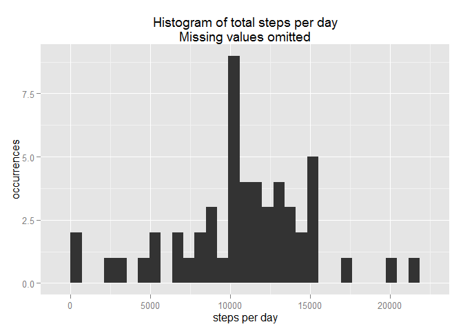
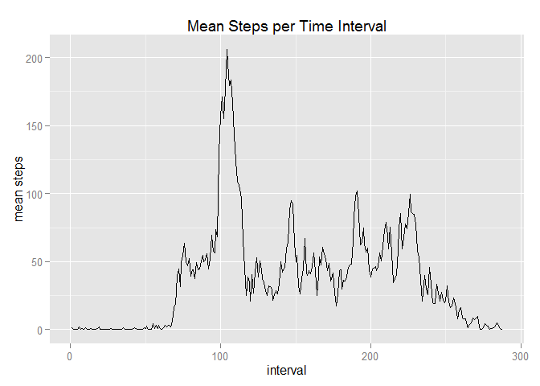
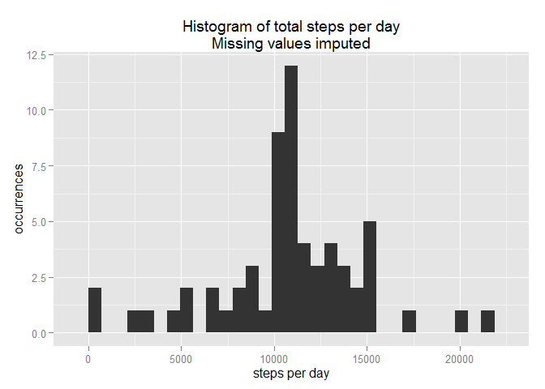
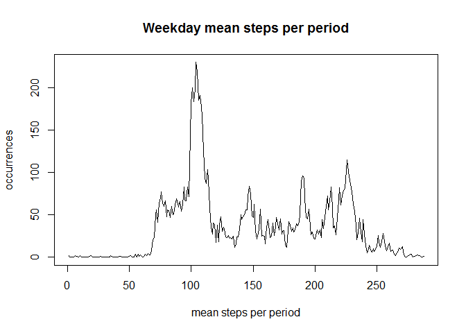
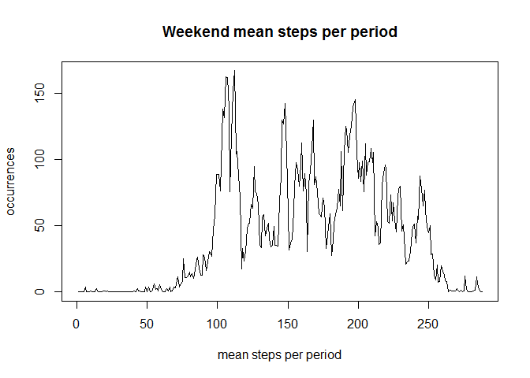

# Reproducible Research: Peer Assessment 1

This report outlines answers to the questions posed in Peer Assessment 1
of the Coursera _Reproducible Research_ course.  The assignment provides
a data file containing step count data for time intervals across several
months.

## Loading and preprocessing the data

The activity.csv file was given as part of the assignment in the form of
a [zip file](https://github.com/rdpeng/RepData_PeerAssessment1).
I extracted the
[CSV file](https://github.com/coursera10062014/RepData_PeerAssessment1/blob/master/activity.csv)
from the zip file.  Here I load that file into a data frame.

The interval column is in an inconvenient form, so I convert it which 5
minute interval of the day it represents.

```r
csv <- read.csv("activity.csv")
cleanupInterval <- function(x) {
  i <- as.integer(x)
  hour <- as.integer(i / 100)
  minute <- i %% 100
  return (((hour * 12) + (minute / 5)) + 1)
}
ci <- sapply(csv$interval, cleanupInterval)
csv$interval <- ci

options(scipen=5)  # prefer fixed-width number presentations.
```

## What is mean total number of steps taken per day?

To get to total steps per day, I will
discard rows with NA steps, then roll up daily sums using the plyr
library.  I'll also compute the mean and median of that population.


```r
library(plyr)
minusNa <- csv[!is.na(csv$steps),]
totalStepsPerDay <- ddply(minusNa, c("date"), summarize,
                          steps=sum(steps))
meanStepsPerDay <- mean(totalStepsPerDay$steps)
medianStepsPerDay <- median(totalStepsPerDay$steps)
```

The mean total steps per day is 
10766.  The median total steps per day is
10765.  The histogram of steps per day is
as follows:


```r
range <- max(totalStepsPerDay$steps) - min(totalStepsPerDay$steps)
library(ggplot2)
qplot(totalStepsPerDay$steps,
      binwidth = range / 30,
      xlab="steps per day",
      main="Histogram of total steps per day\nMissing values omitted",
      ylab="occurrences")
```

 


## What is the average daily activity pattern?

Now rather than slicing by day, I will slice by the time interval.


```r
meanStepsByTimeBucket <- ddply(minusNa, c("interval"), summarize,
                               steps=mean(steps))
maxIndex <- which.max(meanStepsByTimeBucket$steps)
maxSteps <- meanStepsByTimeBucket$steps[maxIndex]
maxInterval <- meanStepsByTimeBucket$interval[maxIndex]
qplot(x=meanStepsByTimeBucket$interval,
      y=meanStepsByTimeBucket$steps,
      geom="line",
      xlab="interval",
      ylab="mean steps",
      main="Mean Steps per Time Interval")
```

 

The 5 minute interval with the most steps is 104, with 206.1698 steps.

## Imputing missing values


```r
missingStepCount <- sum(is.na(csv$steps))
missingDateCount <- sum(is.na(csv$date))
missingIntervalCount <- sum(is.na(csv$interval))
totalRows <- length(csv$steps)
```

Of the 17568 rows in our data set, 2304 have 
missing step entries.  0 having missing dates.
0 are missing the interval.

Only step counts are missing, so I only need impute those.
For missing steps entries, I will impute the mean value for that interval
across all days that did have data for the interval.


```r
missing <- is.na(csv$steps)
intervals <- csv$interval[missing]
imputedSteps <- csv$steps

meanForInterval <- function(i) {
  return (meanStepsByTimeBucket$steps[i])
}

for (i in 1:missingStepCount) {
  imputedSteps[i] = meanForInterval(intervals[i])
}
imputed <- csv
imputed$steps[missing] <- imputedSteps[1:missingStepCount]
```

With the data imputed, let's take another look at the steps per day histogram. 


```r
imputedTotalStepsPerDay <- ddply(imputed, c("date"), summarize,
                                 steps=sum(steps))
imputedMeanStepsPerDay <- mean(imputedTotalStepsPerDay$steps)
imputedMedianStepsPerDay <- median(imputedTotalStepsPerDay$steps)
imputedRange <- max(imputedTotalStepsPerDay$steps)
                - min(imputedTotalStepsPerDay$steps)
```

```
## [1] -41
```

```r
qplot(imputedTotalStepsPerDay$steps,
      binwidth = range / 30,
      xlab="steps per day",
      main="Histogram of total steps per day\nMissing values imputed",
      ylab="occurrences")
```

 

With the values imputed, the mean moved to 10766.1887 from 10766.1887, and the median moved to 10766.1887 from 10765.  This imputation mechanism showed minimal displayment of the mean and median.

## Are there differences in activity patterns between weekdays and weekends?


```r
dp <- lapply(imputed$date, function (d) {
  return (as.POSIXct(strptime(d, "%Y-%m-%d")))
})
isWeekend <- function (d) {
  return (d == "Saturday" || d == "Sunday")
}

dow <- lapply(dp, weekdays)
we <- simplify2array(lapply(dow, isWeekend))
weekDays <- imputed[!we,]
weekends <- imputed[we,]

weekDaySteps <- ddply(weekDays, c("interval"), summarize, steps=mean(steps))
weekendSteps <- ddply(weekends, c("interval"), summarize, steps=mean(steps))

plot(weekDaySteps$interval,
      weekDaySteps$steps,
      type="l",
      xlab="mean steps per period",
      main="Weekday mean steps per period",
      ylab="occurrences") +
plot(weekendSteps$interval,
      weekendSteps$steps,
      type="l",
      xlab="mean steps per period",
      main="Weekend mean steps per period",
      ylab="occurrences")
```

  

```
## numeric(0)
```
